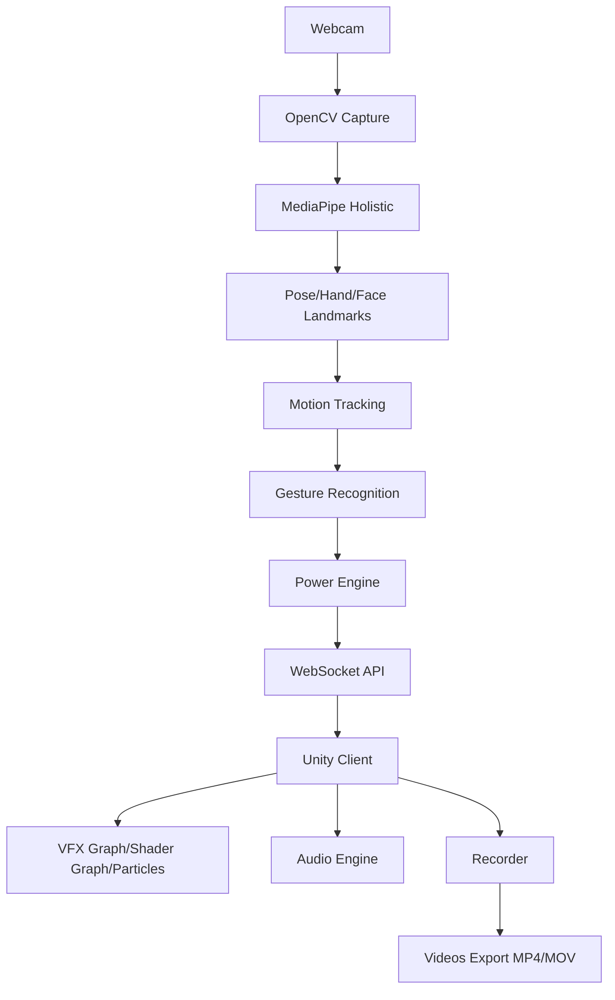
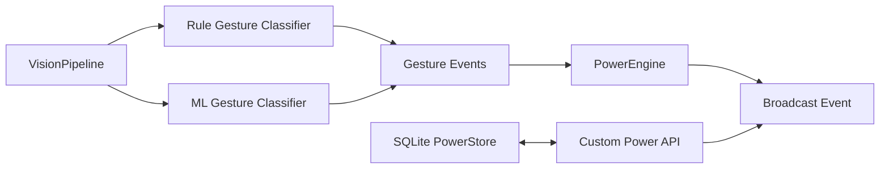
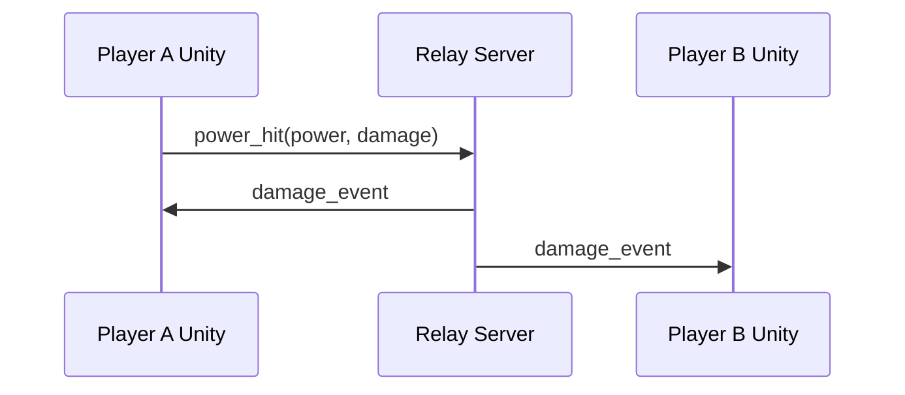

# Architecture Documentation

## End-to-End Pipeline

```mermaid
flowchart TD
    A[Webcam] --> B[OpenCV Capture]
    B --> C[MediaPipe Holistic]
    C --> D[Pose/Hand/Face Landmarks]
    D --> E[Motion Tracking]
    E --> F[Gesture Recognition]
    F --> G[Power Engine]
    G --> H[WebSocket API]
    H --> I[Unity Client]
    I --> J[VFX Graph/Shader Graph/Particles]
    I --> K[Audio Engine]
    I --> L[Recorder]
    L --> M[Videos Export MP4/MOV]
```

## Server Runtime

```mermaid
flowchart LR
    A[VisionPipeline] --> B[Rule Gesture Classifier]
    A --> C[ML Gesture Classifier]
    B --> D[Gesture Events]
    C --> D
    D --> E[PowerEngine]
    E --> F[Broadcast Event]
    G[SQLite PowerStore] <--> H[Custom Power API]
    H --> F
```

## Multiplayer Runtime

```mermaid
sequenceDiagram
    participant A as Player A Unity
    participant S as Relay Server
    participant B as Player B Unity
    A->>S: power_hit(power, damage)
    S->>A: damage_event
    S->>B: damage_event
```
